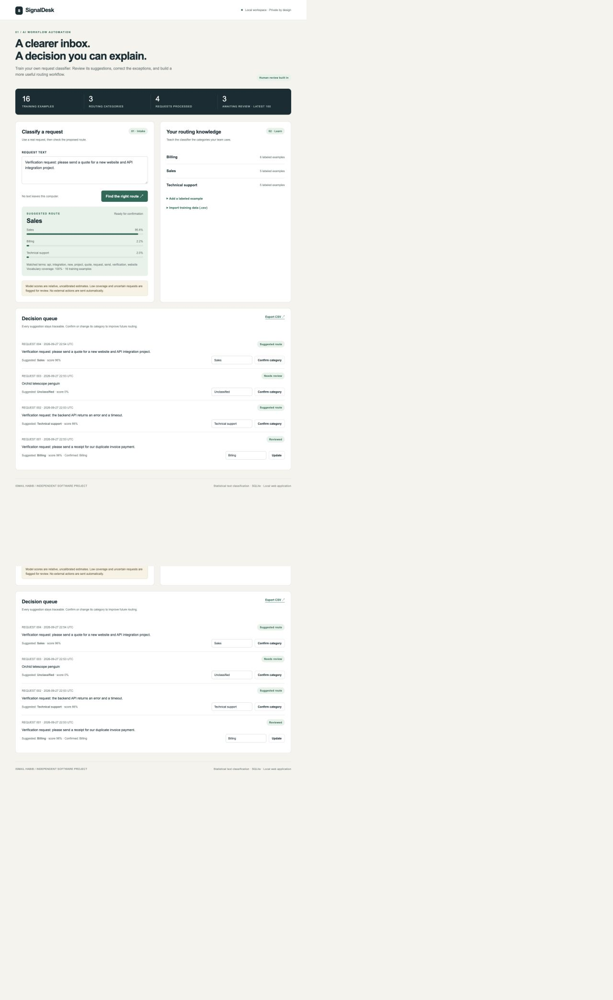
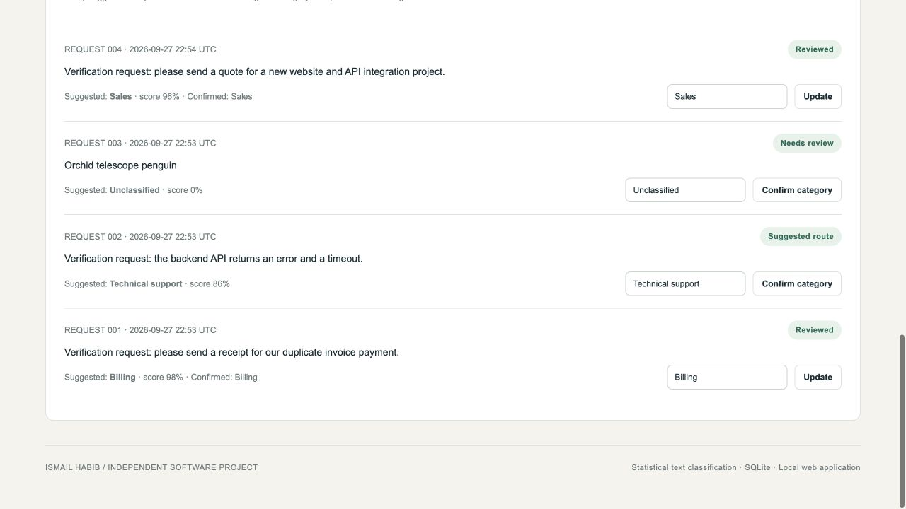

# SignalDesk — trainable request triage

Classify incoming requests using your own labeled examples, inspect the evidence, and confirm or correct each decision. SignalDesk combines a local Naive Bayes classifier, a human review queue, and persistent SQLite history without external services.

An independent working project by Ismail Habib. Screenshots show the running application with labeled verification inputs; they do not represent customer or production activity.

## Features

- Import labeled requests from CSV or add examples in the browser.
- Inspect relative category scores, matched terms, and vocabulary coverage.
- Flag unknown or sparse vocabulary for human review.
- Keep curated training examples separate from changeable review feedback.
- Export the decision queue as CSV.

## Screenshots





See [screenshot captions](screenshots/CAPTIONS.md) for the verification context.

## Quickstart

Requires Python 3.10 or newer; no third-party packages. Run these commands from the cloned repository directory.

```sh
python3 app.py
```

Open http://127.0.0.1:8101. On Windows use `py app.py`. You can set `PORT` to choose another local port. The first run creates `data/` automatically. `APP_DB` can select a different SQLite file. The delivered workspace starts empty; screenshot data is not silently preloaded.

## Use it

1. Open the training CSV import and select `fixtures/training.csv`, or add your own labeled requests.
2. Use at least two categories. Classify a new request.
3. Check the score and matched terms; confirm or correct the category in the decision queue.
4. Export the queue as CSV. The included data is clearly labeled verification input, not client data.

## Training and review behavior

Manual and imported examples are retained as curated training data. The classifier combines these with current human-reviewed requests, deduplicating identical text/category pairs. Updating a review changes only that request's feedback; it cannot delete an imported example or another request's confirmed category. Training counts use the same combined dataset as classification.

Input limits: individual training/request text up to 10,000 characters, category names up to 40 characters, and CSV imports up to 500 rows and 200,000 characters per batch. The file chooser additionally caps CSV files at 200,000 bytes. JSON HTTP requests are capped at 1,000,000 bytes to accommodate Unicode and encoding overhead.

## Test

```sh
python3 -m unittest discover -s tests -v
```

See `TEST_RESULTS.md` for observed checks. Screenshots record a real running local instance; captions identify verification inputs.

## Architecture

Browser → local HTTP API → processing engine → SQLite → review/export.

## Operational boundaries

Scores are not calibrated probabilities. The included dataset is for functional verification, not a trained business model. A deployment should use representative business examples and a separate held-out evaluation set. This version is a single-user local tool with no authentication, cloud hosting, email ingestion, or automatic downstream actions.

The listener binds only to 127.0.0.1. It is designed for one trusted user on one computer. Do not expose it through a tunnel or reverse proxy without adding authentication, encrypted transport, appropriate access controls and deployment review. To back up your work, stop the server and copy the SQLite file.

## Files

- `app.py`: API and persistence
- `engine.py`: classification and scoring logic
- `local_host.py`: bounded local HTTP host
- `static/`: actual working interface
- `tests/`: executable behavioral tests
- `fixtures/`: small original verification inputs
- `screenshots/`: captures and captions

## License

[MIT](LICENSE) — Copyright (c) 2026 Ismail Habib.
